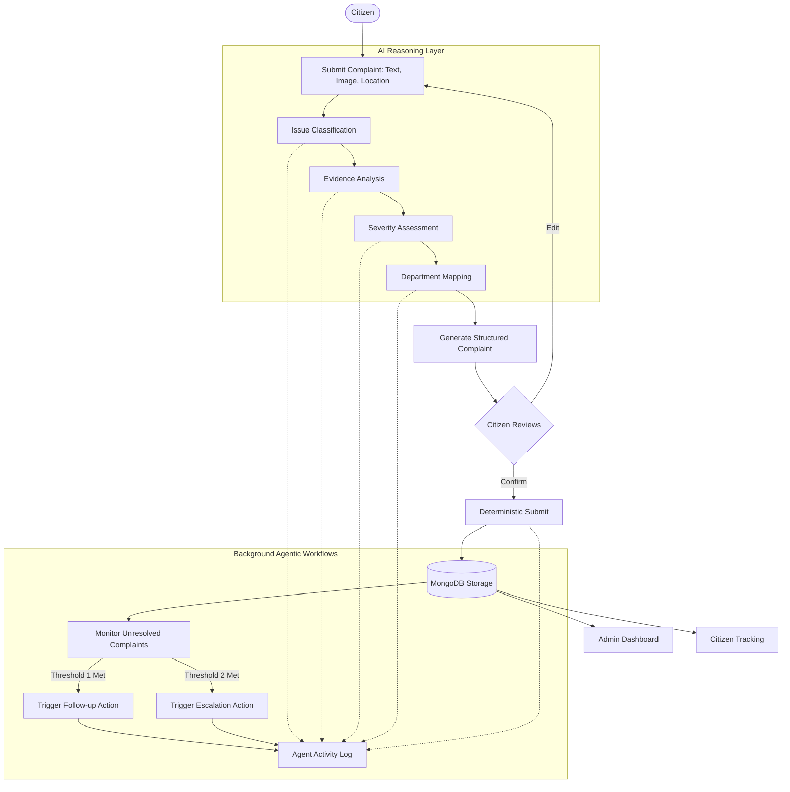

# Agent Workflow Architecture

This document describes the flow of data and responsibility between the citizen, the AI agent, and deterministic application actions.

## 1. Core Workflow Overview

The core philosophy separates **AI Reasoning** (probabilistic interpretation) from **Application Actions** (deterministic operations).

## 2. Stage Details

### A. Citizen Input
- The citizen provides unstructured or semi-structured data (text, images, location).
- **Tooling**: Frontend React application capturing raw user intent.

### B. AI Reasoning (The "Brain")
- **Responsibility**: Understanding citizen language, identifying issues, assessing severity, and recommending the responsible department.
- **Rules**:
  - The AI must output deterministic JSON.
  - The AI does not directly write to the database during this stage.

### C. Validation & Complaint Generation
- The structured JSON is converted into a standard complaint format.
- The citizen is presented with this format to confirm accuracy before official submission.

### D. Submission & Storage
- **Responsibility**: System backend handles database insertion, ID generation, and timestamping.
- **Rules**: Purely deterministic (e.g. standard Express/Mongoose controllers). No AI involved here.

### E. Monitoring, Follow-Up, and Escalation
- A scheduled job or event-driven agent observes the status of complaints.
- If a complaint remains unresolved beyond a configurable threshold, the agent deterministically initiates a follow-up.
- If it exceeds the escalation threshold, the agent escalates the issue.
- **Traceability**: Every autonomous action taken by the agent must be logged in the Agent Activity Log for auditability.
